# Rapport de TP – Application de Gestion Hospitalière avec Spring Boot, Spring Security et Thymeleaf

## 📌 Objectif du TP

L'objectif de ce TP est de développer une application web complète de gestion hospitalière en utilisant Spring Boot comme framework principal, Spring MVC pour l'architecture web,
Thymeleaf comme moteur de templates,Spring Data JPA pour la persistance des données,Spring Security pour la gestion de l'authentification et des autorisations.
Cette application permet de modéliser les principales entités d’un système hospitalier, telles que les patients, les médecins, les rendez-vous, les consultations, et leur gestion au travers de services et d’un contrôleur REST.

L'application doit permettre de :
 - Gérer les patients (CRUD complet).
 - Implémenter une pagination des résultats.
 - Ajouter des fonctionnalités de recherche.
 - Sécuriser l'accès aux différentes fonctionnalités.
 - Utiliser un système de templates pour une interface cohérente.
 - Valider les données des formulaires.

---

## 🧱 Structure du Projet

Le projet suit une architecture MVC (Modèle-Vue-Contrôleur) typique d'une application Spring Boot, il contient les packages suivants :
 - entities : contient les classes de domaine représentant les entités métier : Classe Patient.
 - repositories : contient les interfaces JPA permettant l’accès aux données :
    - Interface PatientRepository: Fournit des méthodes CRUD automatiques et la recherche paginée.
 - security :Gère l'authentification et l'autorisation via Spring Security, incluant la modélisation des utilisateurs/rôles, la configuration de sécurité et les contrôleurs dédiés.
   Il contient les packages:
    - Entités qui contient les classes AppRole pour définir les rôles d'accès et AppUser pour modéliser un utilisateur avec ses credentials et rôles associés.
    - Répo qui contient les interfaces AppRoleRepository / AppUserRepository pour persister et rechercher rôles/utilisateurs en base.
    - Service qui contient l'interface AccountService qui définit les contrats pour la gestion des utilisateurs et rôles, l'implémentation AccountServiceImpl qui implémente les règles métier (validation des mots de passe, gestion des transactions avec @Transactional), ainsi l'implémentation UserDetailServiceImpl pour adapter le modèle AppUser à Spring Security en implémentant UserDetailsService pour l'authentification.
    - La classe SecurityConfig pour configurer les règles d'accès et l'authentification (ex: routes protégées).
 - web : Contient les contrôleurs MVC :
     - Classe PatientController: Gère l'affichage et la recherche des patients.
     - Classe SecurityController: Gère les vues liées à l'authentification.
 - HospitalApplication : Point d'entrée de l'application avec configuration automatique.
 - templates: Contient les vues Thymeleaf pour l'interface utilisateur, structurées avec des fragments réutilisables et des formulaires liés aux entités.Il contient les fichiers suivants:
     - template1.html : Template de base avec navbar et layout commun à toutes les pages.
     - patients.html : Affiche la liste paginée des patients avec recherche et actions (éditer/supprimer).
     - formPatients.html : Formulaire de création d'un patient avec validation.
     - editPatients.html : Vue spécifique pour modifier un patient existant.
     - login.html : Page d'authentification avec formulaire de connexion.
     - notAuthorized.html : Message d'erreur pour les accès non autorisés.
  - application.properties : Paramètres de l'application (BDD, sécurité, etc.).
  - schema.sql : Script SQL pour initialiser la structure de la base de données.
  
    
    

 ---
## 📄 Explication détaillée 
---
 ## 🗂 Package entities
### - Classe Patient :
La classe Patient est une entité JPA qui modélise un patient dans le système hospitalier. Annotée avec @Entity, elle est mappée à une table en base de données c'est à dire que cette classe représente une table dans la base de données, où chaque instance de Patient correspondra à une ligne dans cette table. L'annotation @Id marque le champ id comme clé primaire, tandis que @GeneratedValue(strategy = GenerationType.IDENTITY) permet sa génération automatique. Les contraintes de validation (@NotEmpty, @Size, @DecimalMin) assurent l'intégrité des données c'est à dire que le nom doit être non vide et compris entre 4 et 40 caractères, et le score minimal est fixé à 100.Ainsi, on a utilisé l'annotation @Temporal(TemporalType.DATE) pour préciser que le champ dateNaissance stocke uniquement la date (sans l'heure), et @DateTimeFormat(pattern = "yyyy-MM-dd") standardise son format, ainsi l'attribut malade c'est pour de type boolean pour spécifier l'état de chaque patient.  
Les annotations Lombok (@Data, @NoArgsConstructor, @AllArgsConstructor, @Builder) génèrent automatiquement les getters/setters, constructeurs et un builder. Cette classe sert de fondation pour la persistance et la validation des données patients dans l'application.

  

 ## 🗂️ Package repositories
### - Interface `PatientRepository` : 
L'interface PatientRepository étend JpaRepository, ce qui lui permet d'hériter automatiquement des opérations CRUD de base sans implémentation manuelle, car Spring Data JPA fournit ces fonctionnalités prêtes à l'emploi. Elle inclut deux méthodes de recherche : findByNomContains, une méthode dérivée où Spring génère automatiquement la requête à partir du nom de la méthode, et chercher c'une méthode personnalisée utilisant l'annotation @Query pour spécifier une requête explicite. Les deux méthodes retournent un objet Page contenant les résultats paginés. Les deux méthodes acceptent un paramètre Pageable pour gérer la pagination et le tri.   
L'annotation @Param lie le paramètre keyword à la variable x dans la requête JPQL, pour garantir une liaison sécurisée des paramètres et éviter les injections SQL. Ainsi, ce repository combine à la fois la simplicité des requêtes générées automatiquement et la flexibilité des requêtes personnalisées pour répondre aux besoins spécifiques de l'application.
 

## 🛠️ Package security
### 1.  Package `entities`:
#### - Classe `AppRole`:
La classe AppRole est une entité JPA qui modélise un rôle de sécurité dans l'application. Elle est mappée à une table en base de données en utilisant l'annotation @Entity, tandis que @Id désigne le champ role comme clé primaire. Les annotations Lombok (@Data, @NoArgsConstructor, @AllArgsConstructor, @Builder) génèrent automatiquement les getters/setters, les constructeurs et un builder pour simplifier le code.  
Cette classe permet de gérer les différents rôles (comme "ADMIN" ou "USER") qui seront utilisés pour sécuriser l'accès aux fonctionnalités de l'application via Spring Security. Sa simplicité et son intégration avec JPA en font un composant essentiel pour la gestion des autorisations.

 
 
#### - Classe `AppUser`:
Cette classe représente un utilisateur du système et est conçue pour fonctionner avec Spring Security, car elle stocke les informations d'authentification comme le username et le password, ainsi que les rôles associés via une relation ManyToMany avec AppRole. Le champ username est marqué comme unique (@Column(unique = true)), ce qui empêche les doublons en base de données, tandis que la stratégie de chargement FetchType.EAGER garantit que les rôles sont chargés immédiatement avec l'utilisateur, puisque cela est essentiel pour les vérifications d'autorisation.  
L'utilisation de Lombok évite le code redondant, et l'annotation @Builder facilite la création d'objets complexes. Cette entité à pour rôle de lier les identifiants de connexion aux permissions accordées via les rôles.

 

 ### 2.  Package `repo`:
#### - Interface `AppRoleRepository`:
L'interface AppRoleRepository étend JpaRepository, ce qui lui permet d'hériter automatiquement des opérations CRUD standards (Create, Read, Update, Delete) sans nécessiter d'implémentation manuelle, car Spring Data JPA fournit ces fonctionnalités prêtes à l'emploi. Spécialisée pour l'entité AppRole avec une clé primaire de type String, cette interface simplifie la gestion des rôles en base de données, tandis que son intégration native avec Spring Security facilite les vérifications d'autorisation. 

 
 
#### - Interface `AppUserRepository`:
Cette interface étend aussi de JpaRepository, pour bénéficier des opérations CRUD de base pour la gestion des utilisateurs, mais elle ajoute également une méthode personnalisée findByUsername() pour rechercher un utilisateur par son identifiant. Cette méthode est automatiquement implémentée par Spring Data JPA grâce à la convention de nommage, évitant ainsi d'écrire du code supplémentaire. 

 

  ### 3.  Package `service`:
#### - Interface `AccountService`:
L'interface AccountService définit le contrat pour la gestion des utilisateurs et des rôles dans le système de sécurité. Elle propose des méthodes pour créer un nouvel utilisateur (avec vérification du mot de passe via le paramètre confirmPassword), ajouter/supprimer des rôles, et manipuler les associations entre utilisateurs et rôles. La méthode loadUserByUsername permet de récupérer un utilisateur pour l'authentification, ce qui est crucial pour Spring Security. Cette abstraction offre une séparation claire entre la couche métier et l'implémentation, facilitant ainsi la maintenance tout en centralisant la logique de gestion des comptes. Les paramètres comme email et confirmPassword permettent des validations supplémentaires ce qui montre une approche orientée sécurité.

 

 #### - Implémentation `AccountServiceImpl`:
L'implémentation AccountServiceImpl implémente AccountService et fournit une gestion complète des utilisateurs et rôles, tout en assurant la sécurité des opérations grâce à l'annotation @Transactional qui garantit l'intégrité des données. Elle utilise AppUserRepository et AppRoleRepository pour persister les informations, ainsi que PasswordEncoder pour hacher les mots de passe, ce qui renforce la sécurité contre les attaques. Les méthodes addNewUser et addNewRole vérifient d'abord l'existence des entités avant de les créer, évitant ainsi les doublons, puis confirme que les mots de passe saisis (password et confirmPassword) correspondent. Si tout est valide, elle utilise le pattern Builder (via Lombok) pour construire l'objet, tandis que addRoleToUser récupère l'utilisateur par son username et le rôle par son ID, puis ajoute le rôle à la liste roles de l'utilisateur , ainsi on a utilisé @Transactional pour la mise à jour automatique, et removeRoleFromUser retire un rôle d'un utilisateur. Similaire à addRoleToUser, mais utilise remove() sur la liste roles.  
La méthode loadUserByUsername récupère un utilisateur par son username via appUserRepository.findByUsername(). Cette méthode est essentielle pour Spring Security, qui l'utilise lors de l'authentification pour charger les détails de l'utilisateur (credentials, rôles, etc.).

 
  
   

 #### - Implémentation `UserDetailServiceImpl`:
La classe UserDetailServiceImpl implémente l'interface UserDetailsService de Spring Security, servant de pont entre notre modèle d'utilisateur personnalisé (AppUser) et le système d'authentification de Spring. Elle injecte AccountService via Lombok (@AllArgsConstructor) pour accéder aux données utilisateurs. la méthode loadUserByUsername récupère un AppUser via accountService.loadUserByUsername(), si l'utilisateur n'existe pas une exception UsernameNotFoundException est affichée. Ensuite, elle transforme les rôles (entités AppRole) en tableau de Strings via un stream Java puis construit un objet UserDetails (standard Spring Security) avec le username et mot de passe haché. Ainsi, les rôles sont formé au tableau via la méthode roles().

 
 
 #### - Classe `SecurityConfig`:
La classe SecurityConfig c'est la classe essentiel pour la configuration Spring Security, elle est marquée par @EnableWebSecurity et @EnableMethodSecurity pour activer la sécurité web et les annotations de contrôle d'accès. Elle propose trois approches d'authentification :
   - InMemory: Crée des utilisateurs en mémoire avec InMemoryUserDetailsManager,il est utile pour les tests.
   - JDBC: Permet une authentification via base de données avec JdbcUserDetailsManager.
   - Personnalisée: Dans cette approche on utilise UserDetailServiceImpl pour charger les utilisateurs depuis notre modèle personnalisé (AppUser).
La configuration active (securityFilterChain) définit :
    - Un formulaire de login personnalisé (/login) avec redirection vers /user/index après succès.
    - Un système "remember-me" avec clé unique et durée de validité (14 jours).
    - Des règles d'accès : qui permet l'accès aux ressources statiques (/webjars/**). Il exige une authentification pour toutes les autres requêtes (anyRequest().authenticated()).Ainsi , une page d'erreur dédiée (/notAuthorized).
Cette configuration offre une sécurité flexible, prête pour une montée en charge (en décommentant JDBC) tout en intégrant notre modèle métier via UserDetailServiceImpl.

## 🌐 Package Web:
###  - Classe `PatientController`:
Ce contrôleur Spring MVC gère toutes les opérations liées aux patients en suivant une architecture RESTful et sécurisée. La méthode principale index() implémente une pagination intelligente avec recherche via patientRepository.findByNomContains(), où les paramètres page, size et keyword permettent une navigation fluide dans les résultats. Les données paginées sont transmises au modèle Thymeleaf avec :    
       - La liste des patients (pagePatients.getContent()).      
       - Le tableau des pages disponibles (totalPages).      
       - La page courante et le mot-clé de recherche pour conserver le contexte.      
Les méthodes sécurisées par @PreAuthorize("hasRole('ROLE_ADMIN')") (comme delete(), formPatient(), save() et editPatient()) montrent une gestion fine des permissions :    
      - La suppression (delete) conserve les paramètres de pagination dans la redirection, Il reçoit l'ID du patient et le contexte (page/keyword) via @RequestParam, puis supprime le patient via patientRepository.deleteById(id) ensuite, il redirige vers la liste en conservant la pagination/recherche (redirect:/user/index?page=...).      
      - Le formulaire d'édition (editPatient) pré-remplit les champs avec les données existantes et récupère le patient existant via patientRepository.findById(id), il transmet au modèle le patient à éditer et le contexte (page/keyword) pour la redirection ensuite il affiche editPatients.html pré-rempli.      
      - La méthode formPatient() : Prépare un nouveau patient vide (new Patient()) et transmet l'objet au modèle pour le formulaire Thymeleaf ensuite il affiche la vue formPatients.html.      
      - Méthode save() : on a utilisé @Valid pour vérifier les contraintes de l'entité (@Size, @DecimalMin, etc.) et BindingResult capture les erreurs de validation.        

Les endpoints /patients (en JSON via @ResponseBody) et /formPatients illustrent la double capacité à servir du JSON pour des APIs et des vues HTML. La redirection depuis / vers /user/index garantit une entrée utilisateur cohérente.

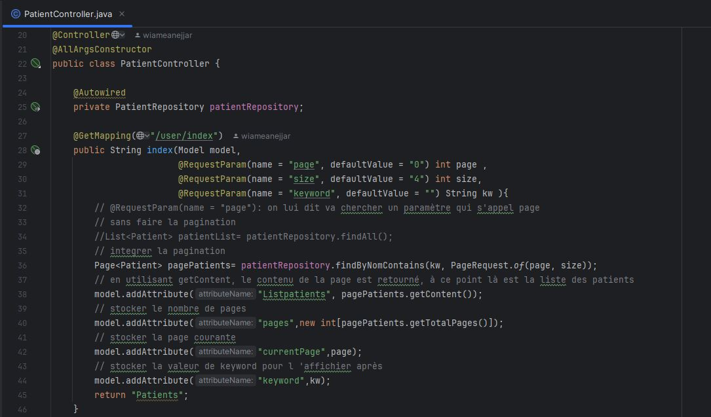 
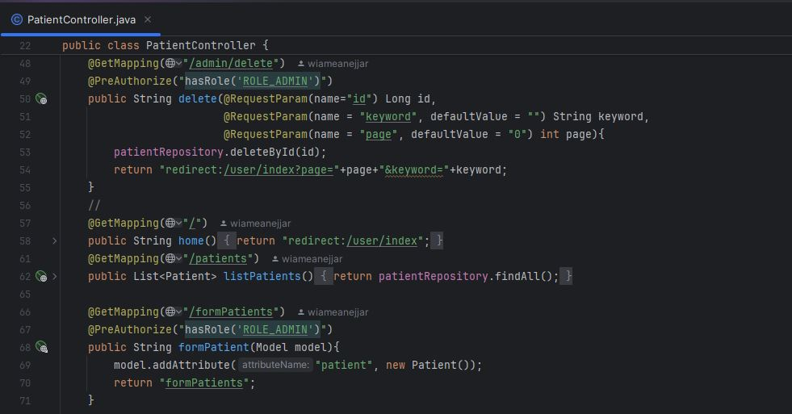
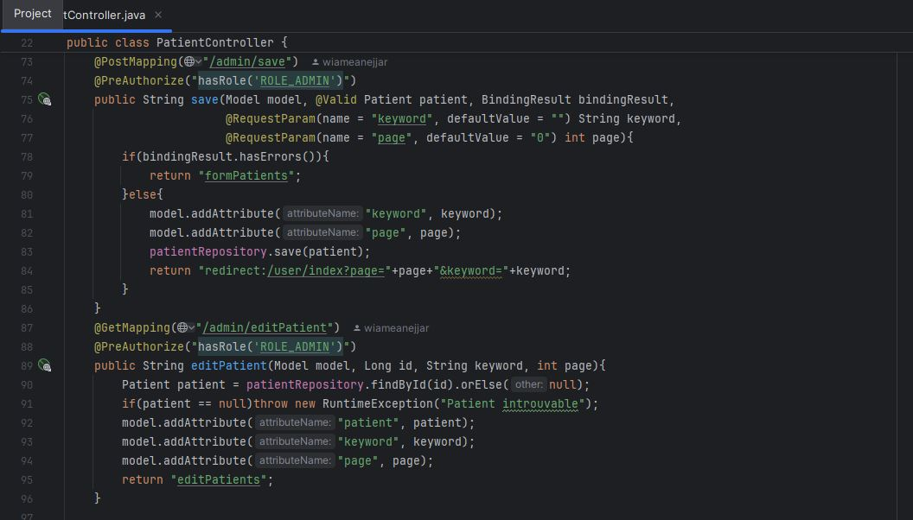 

###  - Classe `SecurityController`:
Ce contrôleur Spring MVC, annoté @Controller, gère exclusivement les vues liées à la sécurité de l'application. Il expose deux endpoints simples mais essentiels :  
        - /notAuthorized : Affiche la page notAuthorized.html (via le retour de chaîne) lorsqu'un utilisateur tente d'accéder à une ressource sans les permissions requises. Cette redirection est typiquement configurée dans SecurityConfig via exceptionHandling().accessDeniedPage().  
        - /login : Renvoie la vue login.html contenant le formulaire d'authentification. Ce endpoint est généralement référencé dans la configuration Spring Security (formLogin().loginPage("/login")) pour personnaliser le processus de connexion.  

Ce contrôleur minimaliste illustre la séparation des responsabilités : SecurityConfig gère la logique de sécurité, tandis que SecurityController fournit les vues associées.

 

## Classe Principale `HopitalApplication`:
La classe HopitalApplication est la classe principale de l'application Spring Boot, marquée par @SpringBootApplication. Elle sert de point de démarrage et configure trois méthodes essentielles annotées @Bean pour : initialiser les données patients, gérer la sécurité des utilisateurs, et encoder les mots de passe. Ces méthodes illustrent différentes approches pour la base de données et sécuriser l'accès aux fonctionnalités.Voici une explication détaillé de ce qu'il contient : 
1. Méthode start() :
Cette méthode CommandLineRunner illustre trois approches pour créer et persister des entités Patient au démarrage de l'application.  
   - Approche impérative classique : On instancie un Patient via le constructeur par défaut et on définit chaque propriété via des setters (setNom(), setScore(), etc.).
   - Approche par constructeur paramétré : Utilisation directe d'un constructeur avec tous les arguments.
   - Pattern Builder (Lombok) : On utilise Patient.builder() qui permet une construction chaînée et lisible, idéale pour les objets complexes. Les propriétés sont définies via des méthodes claires (nom("Anejjar"), score(56)), et build() valide l'objet.
      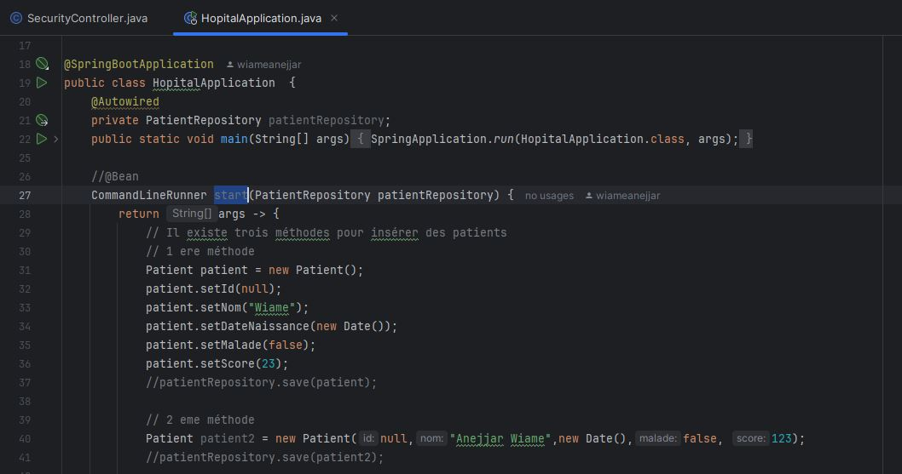
      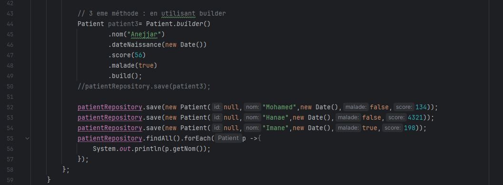 

2. Méthode commandLineRunnerUserDetails() :
   Cette méthode illustre l'initialisation des données de sécurité via le service métier AccountService. Elle crée deux rôles ("USER" et "ADMIN") et trois utilisateurs, dont un administrateur cumulant les deux rôles. Chaque utilisateur est enregistré avec son mot de passe haché (grâce au PasswordEncoder), démontrant comment peupler la base avec des données cohérentes pour les tests. Elle sert de référence pour une initialisation métier (via AppUser/AppRole) plutôt que directe en base.
   - La méthode passwordEncoder() est annotée @Bean configure et expose un encodeur de mots de passe BCrypt, essentiel pour la sécurité de l'application. En utilisant BCryptPasswordEncoder, elle garantit que tous les mots de passe sont stockés sous forme hachée (avec salage automatique), protégeant ainsi contre les attaques par force brute. Ce composant est ensuite injecté dans AccountService pour sécuriser la création des utilisateurs.
  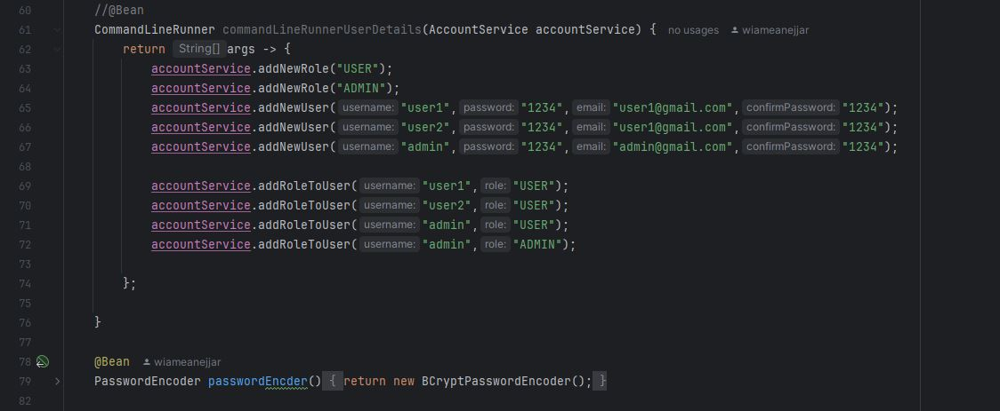 
3. Méthode commandLineRunner() (JdbcUserDetailsManager) :
Dans cette méthode on utilise JdbcUserDetailsManager, elle configure des utilisateurs en base via Spring Security. Contrairement à la méthode précédente, elle opère au niveau infrastructure (sans passer par le service métier) et vérifie l'existence des utilisateurs avant création. Cette approche, bien que fonctionnelle, est moins flexible que l'utilisation d'AccountService car elle dépend du schéma de tables prédéfini par Spring Security. 
  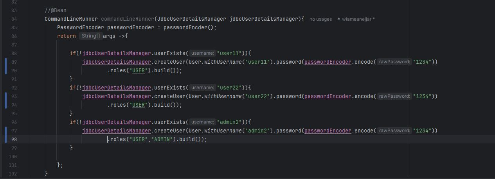 

##  Package templates:
###  Template `editPatients`:
Ce template Thymeleaf utilise une architecture modulaire en héritant du layout principal template1 via layout:decorate, tout en injectant son contenu spécifique dans la section content1 (balise div layout:fragment). Le formulaire est conçu pour créer/modifier des patients avec :  
    - Champs du Formulaire :  
        - ID : Champ caché (pour les modifications) affiché en lecture seule.  
        - Nom : Champ texte avec validation côté serveur (th:errors).  
        - Date de Naissance : Input de type date avec format standard  
        - Statut Malade : Checkbox booléen.  
        - Score : Input numérique avec validation.  
    - Fonctionnalités: Dans ce formulaire on conserve le contexte (pagination/recherche) via paramètres dans l'action (/admin/save?page=${page}&keyword=${keyword}), ainsi on affiche dynamiquement des erreurs de validation Jakarta EE (th:errors) en rouge .Binding automatique avec l'objet Patient du modèle (th:value, th:checked).  
    - Sécurité: Pour la sécurité on a utilsé action POST pour protéger par Spring Security (route /admin/save) , aussi la protection CSRF  implicite (activée par défaut avec Thymeleaf et Spring Security).  
 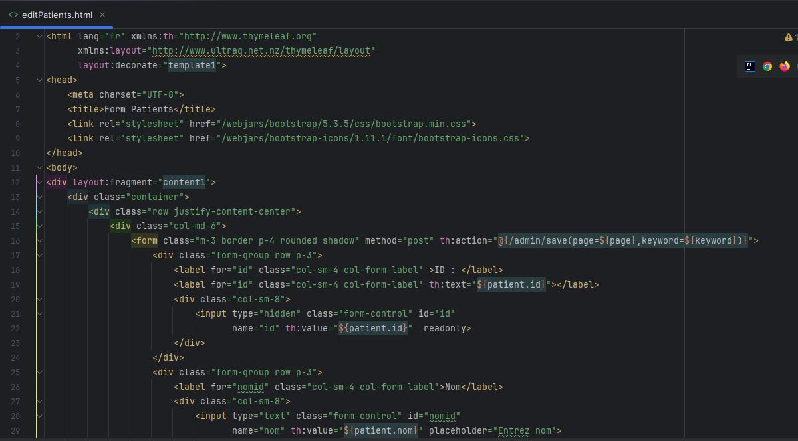 
 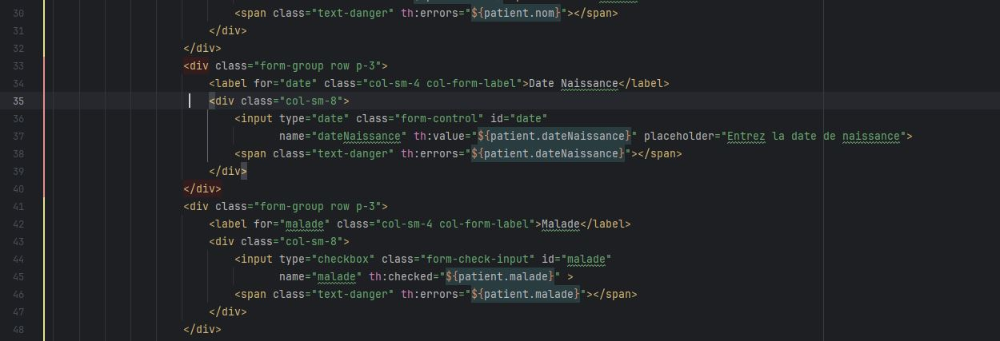 
  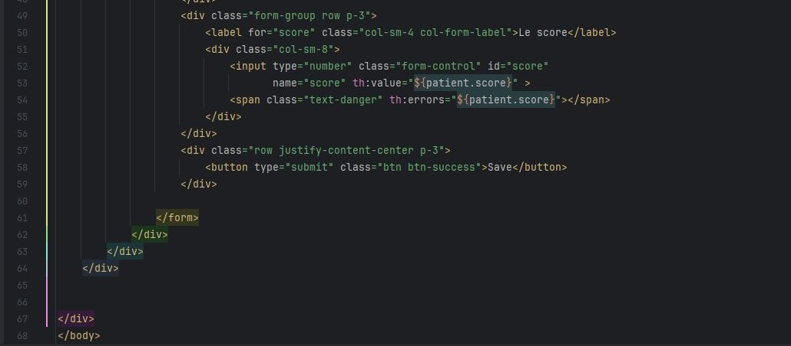 

###  Template `formPatients`:
Dans cette template Thymeleaf on crée un formulaire de gestion des patients qui s'intègre dans le layout principal 'template1' via le système de fragments. Le formulaire implémente plusieurs fonctionnalités clés : il pré-remplit dynamiquement les champs grâce aux expressions Thymeleaf (th:value, th:checked) en se basant sur l'objet Patient transmis par le contrôleur, tout en affichant les éventuels messages d'erreur de validation (th:errors) sous chaque champ.  
La soumission s'effectue vers l'endpoint '/admin/save' en méthode POST, protégé par Spring Security. Les différents champs capturent les informations essentielles d'un patient : nom (avec placeholder), date de naissance (via un sélecteur de date natif), statut médical (case à cocher) et score (entier numérique). Enfin ,le bouton de soumission stylisé en vert.  
 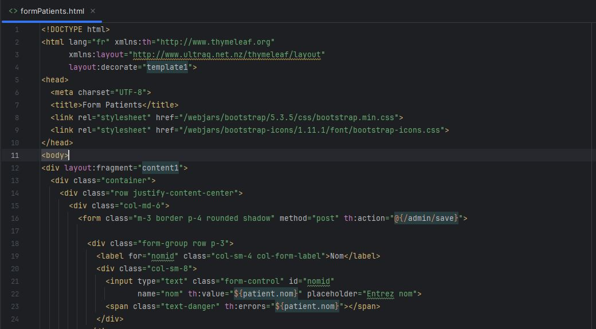 
 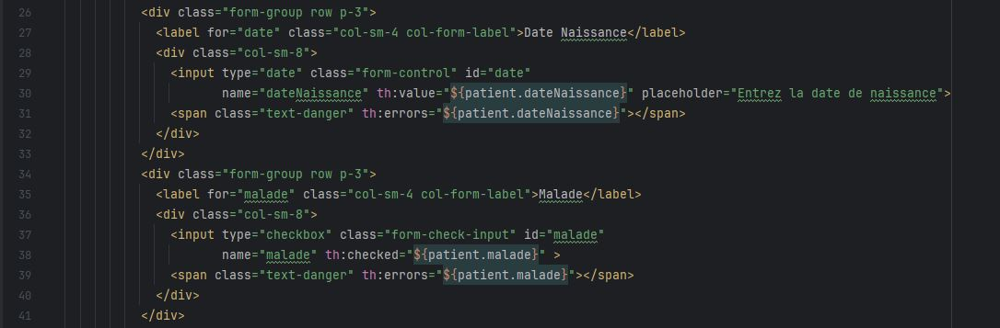 
 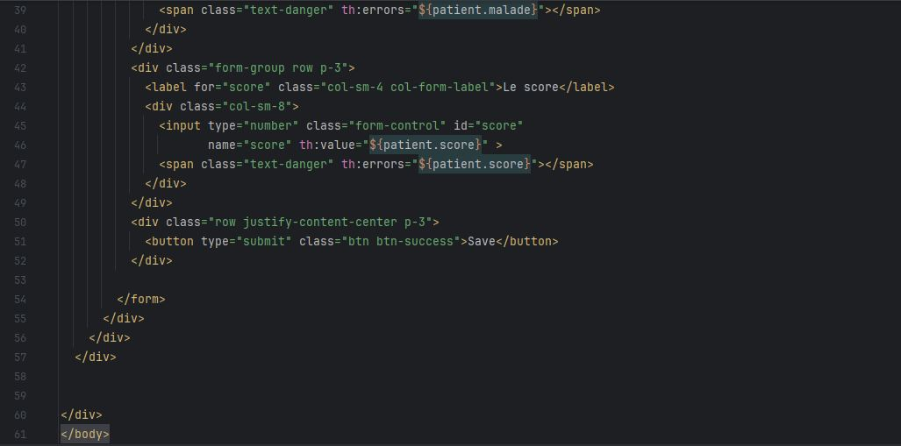 
###  Template `login`:
###  Template `notAuthorized`:
###  Template `Patients`:
###  Template `template1`:

## ⚙️ Configuration (`application.properties`):
Ce fichier contient les techniques de configuration de l'application Spring Boot avec des paramètres critiques.     
    - Le port d'exécution est défini sur 8084 (server.port), tandis que la connexion à une base de données MySQL/MariaDB locale est établie via l'URL jdbc:mysql://localhost:3306/hospital, avec auto-création de la base si inexistante.    
    - La configuration JPA/Hibernate (spring.jpa.hibernate.ddl-auto=update) permet une mise à jour automatique du schéma de base de données, et le dialecte MariaDB est explicitement spécifié pour optimiser les requêtes SQL.    
    - Le mode spring.sql.init.mode=always assure l'exécution des scripts SQL d'initialisation, tandis que spring.jpa.defer-datasource-initialization=true retarde l'initialisation jusqu'à ce que la DataSource soit prête.    
 Pour le développement, le cache Thymeleaf est désactivé (false) pour permettre des modifications en temps réel, et la locale est fixée en français.  
    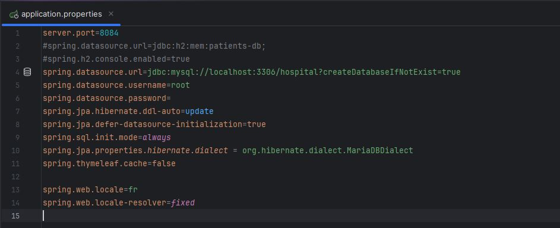
    
###  - Schéma.sql:
Ce script SQL configure le schéma de base de données nécessaire pour l'authentification via Spring Security en mode JDBC. Trois opérations clés sont réalisées :
  - Table users crée la table principale des utilisateurs avec : username (clé primaire), password (stocké haché),enabled (statut d'activation du compte).
  - Table authorities définit les rôles des utilisateurs avec : username (clé étrangère liée à users), authority (rôle comme 'ROLE_ADMIN').
  - Contrainte : Une clé étrangère (fk_authorities_users) assure l'intégrité référentielle.
  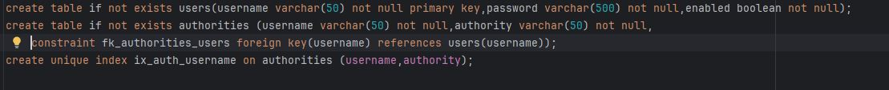
 
    
## - Résultats : 

 ## - Conclusion
Ce TP m’a permis de mettre en œuvre une application Spring Boot complète de gestion hospitalière, avec intégration de plusieurs entités métier liées entre elles (Patient, Medecin, RendezVous, Consultation).
Grâce à Spring Data JPA, l’initialisation des données, et la console H2, j’ai pu tester le cycle complet de création, persistance et consultation des enregistrements.
Il renforce aussi la compréhension des relations entre entités, de l’utilisation des repositories JPA, et de la configuration d’une base de données embarquée pour un développement efficace.

Auteur :  
Anejjar Wiame

 
  
