# Rapport de TP – Application de Gestion Hospitalière avec Spring Boot, Spring Security et Thymeleaf

## 📌 Objectif du TP

L'objectif de ce TP est de développer une application web complète de gestion hospitalière en utilisant Spring Boot comme framework principal, Spring MVC pour l'architecture web,
Thymeleaf comme moteur de templates,Spring Data JPA pour la persistance des données,Spring Security pour la gestion de l'authentification et des autorisations.
Cette application permet de modéliser les principales entités d’un système hospitalier, telles que les patients, les médecins, les rendez-vous, les consultations, et leur gestion au travers de services et d’un contrôleur REST.

L'application doit permettre de :
 - Gérer les patients (CRUD complet).
 - Implémenter une pagination des résultats.
 - Ajouter des fonctionnalités de recherche.
 - Sécuriser l'accès aux différentes fonctionnalités.
 - Utiliser un système de templates pour une interface cohérente.
 - Valider les données des formulaires.

---

## 🧱 Structure du Projet

Le projet suit une architecture MVC (Modèle-Vue-Contrôleur) typique d'une application Spring Boot, il contient les packages suivants :
 - entities : contient les classes de domaine représentant les entités métier : Classe Patient.
 - repositories : contient les interfaces JPA permettant l’accès aux données :
    - Interface PatientRepository: Fournit des méthodes CRUD automatiques et la recherche paginée.
 - security :Gère l'authentification et l'autorisation via Spring Security, incluant la modélisation des utilisateurs/rôles, la configuration de sécurité et les contrôleurs dédiés.
   Il contient les packages:
    - Entités qui contient les classes AppRole pour définir les rôles d'accès et AppUser pour modéliser un utilisateur avec ses credentials et rôles associés.
    - Répo qui contient les interfaces AppRoleRepository / AppUserRepository pour persister et rechercher rôles/utilisateurs en base.
    - Service qui contient l'interface AccountService qui définit les contrats pour la gestion des utilisateurs et rôles, l'implémentation AccountServiceImpl qui implémente les règles métier (validation des mots de passe, gestion des transactions avec @Transactional), ainsi l'implémentation UserDetailServiceImpl pour adapter le modèle AppUser à Spring Security en implémentant UserDetailsService pour l'authentification.
    - La classe SecurityConfig pour configurer les règles d'accès et l'authentification (ex: routes protégées).
 - web : Contient les contrôleurs MVC :
     - Classe PatientController: Gère l'affichage et la recherche des patients.
     - Classe SecurityController: Gère les vues liées à l'authentification.
 - HospitalApplication : Point d'entrée de l'application avec configuration automatique.
 - templates: Contient les vues Thymeleaf pour l'interface utilisateur, structurées avec des fragments réutilisables et des formulaires liés aux entités.Il contient les fichiers suivants:
     - template1.html : Template de base avec navbar et layout commun à toutes les pages.
     - patients.html : Affiche la liste paginée des patients avec recherche et actions (éditer/supprimer).
     - formPatients.html : Formulaire de création d'un patient avec validation.
     - editPatients.html : Vue spécifique pour modifier un patient existant.
     - login.html : Page d'authentification avec formulaire de connexion.
     - notAuthorized.html : Message d'erreur pour les accès non autorisés.
  - application.properties : Paramètres de l'application (BDD, sécurité, etc.).
  - schema.sql : Script SQL pour initialiser la structure de la base de données.
  
  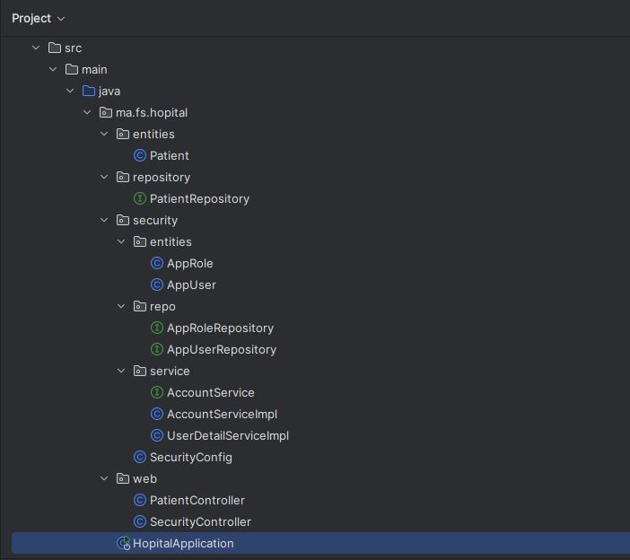  
  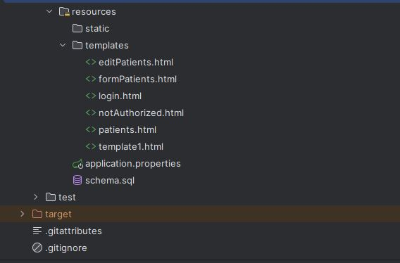  

 ---
## 📄 Explication détaillée 
---
 ## 🗂 Package entities
### - Classe Patient :
La classe Patient est une entité JPA qui modélise un patient dans le système hospitalier. Annotée avec @Entity, elle est mappée à une table en base de données c'est à dire que cette classe représente une table dans la base de données, où chaque instance de Patient correspondra à une ligne dans cette table. L'annotation @Id marque le champ id comme clé primaire, tandis que @GeneratedValue(strategy = GenerationType.IDENTITY) permet sa génération automatique. Les contraintes de validation (@NotEmpty, @Size, @DecimalMin) assurent l'intégrité des données c'est à dire que le nom doit être non vide et compris entre 4 et 40 caractères, et le score minimal est fixé à 100.Ainsi, on a utilisé l'annotation @Temporal(TemporalType.DATE) pour préciser que le champ dateNaissance stocke uniquement la date (sans l'heure), et @DateTimeFormat(pattern = "yyyy-MM-dd") standardise son format, ainsi l'attribut malade c'est pour de type boolean pour spécifier l'état de chaque patient.  
Les annotations Lombok (@Data, @NoArgsConstructor, @AllArgsConstructor, @Builder) génèrent automatiquement les getters/setters, constructeurs et un builder. Cette classe sert de fondation pour la persistance et la validation des données patients dans l'application.

  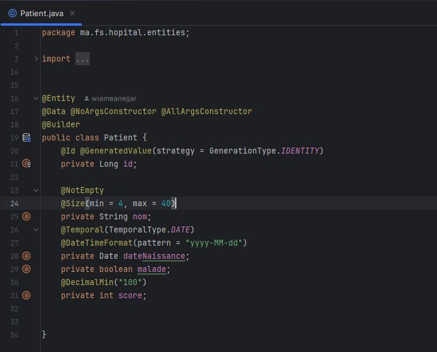

 ## 🗂️ Package repositories
### - Interface `PatientRepository` : 
L'interface PatientRepository étend JpaRepository, ce qui lui permet d'hériter automatiquement des opérations CRUD de base sans implémentation manuelle, car Spring Data JPA fournit ces fonctionnalités prêtes à l'emploi. Elle inclut deux méthodes de recherche : findByNomContains, une méthode dérivée où Spring génère automatiquement la requête à partir du nom de la méthode, et chercher c'une méthode personnalisée utilisant l'annotation @Query pour spécifier une requête explicite. Les deux méthodes retournent un objet Page contenant les résultats paginés. Les deux méthodes acceptent un paramètre Pageable pour gérer la pagination et le tri.   
L'annotation @Param lie le paramètre keyword à la variable x dans la requête JPQL, pour garantir une liaison sécurisée des paramètres et éviter les injections SQL. Ainsi, ce repository combine à la fois la simplicité des requêtes générées automatiquement et la flexibilité des requêtes personnalisées pour répondre aux besoins spécifiques de l'application.
 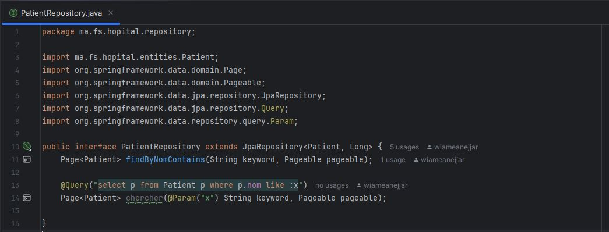

## 🛠️ Package security
### 1.  Package `entities`:
#### - Classe `AppRole`:
La classe AppRole est une entité JPA qui modélise un rôle de sécurité dans l'application. Elle est mappée à une table en base de données en utilisant l'annotation @Entity, tandis que @Id désigne le champ role comme clé primaire. Les annotations Lombok (@Data, @NoArgsConstructor, @AllArgsConstructor, @Builder) génèrent automatiquement les getters/setters, les constructeurs et un builder pour simplifier le code.  
Cette classe permet de gérer les différents rôles (comme "ADMIN" ou "USER") qui seront utilisés pour sécuriser l'accès aux fonctionnalités de l'application via Spring Security. Sa simplicité et son intégration avec JPA en font un composant essentiel pour la gestion des autorisations.

 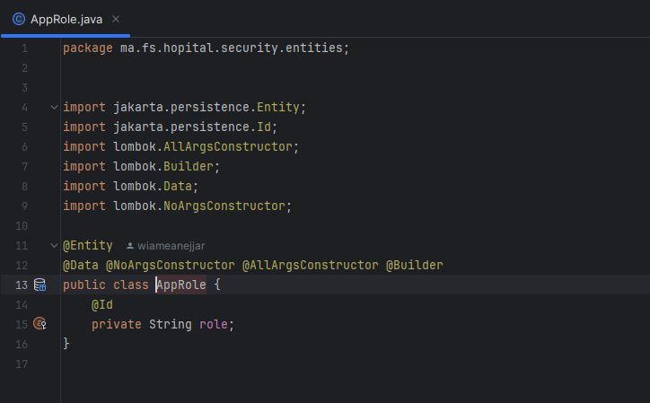
 
#### - Classe `AppUser`:
Cette classe représente un utilisateur du système et est conçue pour fonctionner avec Spring Security, car elle stocke les informations d'authentification comme le username et le password, ainsi que les rôles associés via une relation ManyToMany avec AppRole. Le champ username est marqué comme unique (@Column(unique = true)), ce qui empêche les doublons en base de données, tandis que la stratégie de chargement FetchType.EAGER garantit que les rôles sont chargés immédiatement avec l'utilisateur, puisque cela est essentiel pour les vérifications d'autorisation.  
L'utilisation de Lombok évite le code redondant, et l'annotation @Builder facilite la création d'objets complexes. Cette entité à pour rôle de lier les identifiants de connexion aux permissions accordées via les rôles.

 

 ### 2.  Package `repo`:
#### - Interface `AppRoleRepository`:
L'interface AppRoleRepository étend JpaRepository, ce qui lui permet d'hériter automatiquement des opérations CRUD standards (Create, Read, Update, Delete) sans nécessiter d'implémentation manuelle, car Spring Data JPA fournit ces fonctionnalités prêtes à l'emploi. Spécialisée pour l'entité AppRole avec une clé primaire de type String, cette interface simplifie la gestion des rôles en base de données, tandis que son intégration native avec Spring Security facilite les vérifications d'autorisation. 

 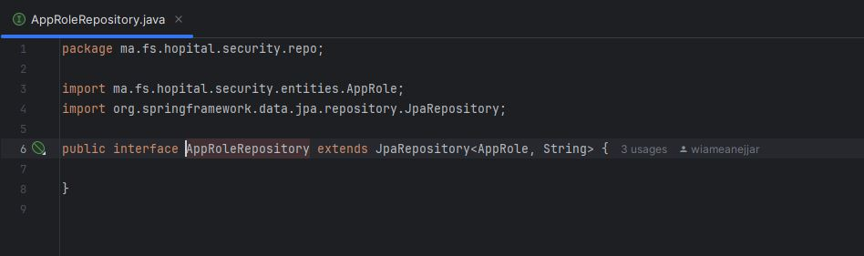
 
#### - Interface `AppUserRepository`:
Cette interface étend aussi de JpaRepository, pour bénéficier des opérations CRUD de base pour la gestion des utilisateurs, mais elle ajoute également une méthode personnalisée findByUsername() pour rechercher un utilisateur par son identifiant. Cette méthode est automatiquement implémentée par Spring Data JPA grâce à la convention de nommage, évitant ainsi d'écrire du code supplémentaire. 

 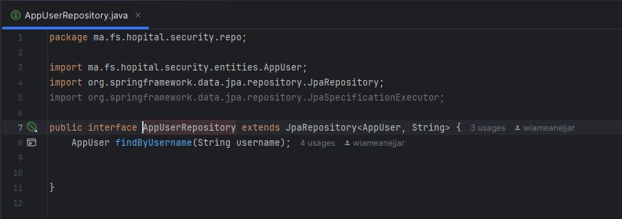

  ### 3.  Package `service`:
#### - Interface `AccountService`:
L'interface AccountService définit le contrat pour la gestion des utilisateurs et des rôles dans le système de sécurité. Elle propose des méthodes pour créer un nouvel utilisateur (avec vérification du mot de passe via le paramètre confirmPassword), ajouter/supprimer des rôles, et manipuler les associations entre utilisateurs et rôles. La méthode loadUserByUsername permet de récupérer un utilisateur pour l'authentification, ce qui est crucial pour Spring Security. Cette abstraction offre une séparation claire entre la couche métier et l'implémentation, facilitant ainsi la maintenance tout en centralisant la logique de gestion des comptes. Les paramètres comme email et confirmPassword permettent des validations supplémentaires ce qui montre une approche orientée sécurité.

 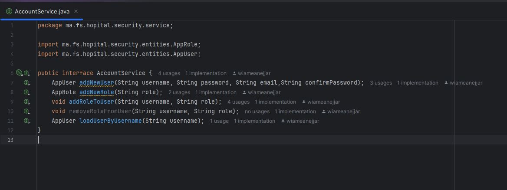

 #### - Implémentation `AccountServiceImpl`:
L'implémentation AccountServiceImpl implémente AccountService et fournit une gestion complète des utilisateurs et rôles, tout en assurant la sécurité des opérations grâce à l'annotation @Transactional qui garantit l'intégrité des données. Elle utilise AppUserRepository et AppRoleRepository pour persister les informations, ainsi que PasswordEncoder pour hacher les mots de passe, ce qui renforce la sécurité contre les attaques. Les méthodes addNewUser et addNewRole vérifient d'abord l'existence des entités avant de les créer, évitant ainsi les doublons, puis confirme que les mots de passe saisis (password et confirmPassword) correspondent. Si tout est valide, elle utilise le pattern Builder (via Lombok) pour construire l'objet, tandis que addRoleToUser récupère l'utilisateur par son username et le rôle par son ID, puis ajoute le rôle à la liste roles de l'utilisateur , ainsi on a utilisé @Transactional pour la mise à jour automatique, et removeRoleFromUser retire un rôle d'un utilisateur. Similaire à addRoleToUser, mais utilise remove() sur la liste roles.  
La méthode loadUserByUsername récupère un utilisateur par son username via appUserRepository.findByUsername(). Cette méthode est essentielle pour Spring Security, qui l'utilise lors de l'authentification pour charger les détails de l'utilisateur (credentials, rôles, etc.).

 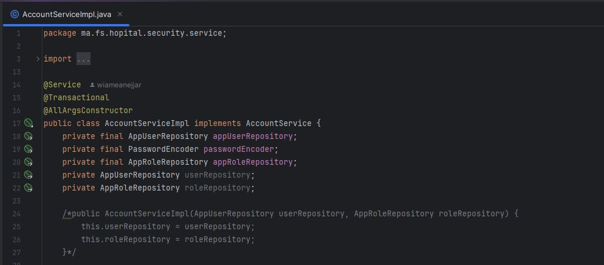
  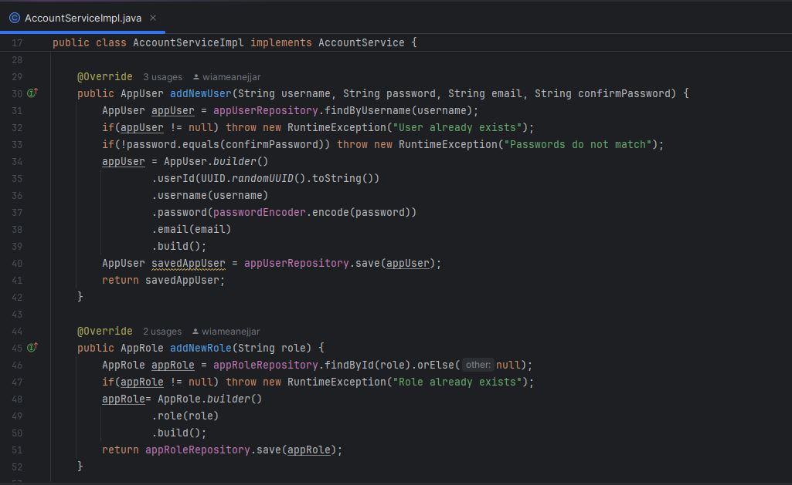
   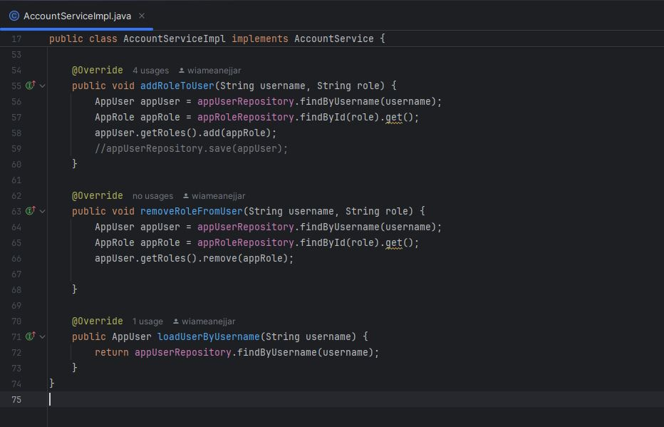

 #### - Implémentation `UserDetailServiceImpl`:
La classe UserDetailServiceImpl implémente l'interface UserDetailsService de Spring Security, servant de pont entre notre modèle d'utilisateur personnalisé (AppUser) et le système d'authentification de Spring. Elle injecte AccountService via Lombok (@AllArgsConstructor) pour accéder aux données utilisateurs. la méthode loadUserByUsername récupère un AppUser via accountService.loadUserByUsername(), si l'utilisateur n'existe pas une exception UsernameNotFoundException est affichée. Ensuite, elle transforme les rôles (entités AppRole) en tableau de Strings via un stream Java puis construit un objet UserDetails (standard Spring Security) avec le username et mot de passe haché. Ainsi, les rôles sont formé au tableau via la méthode roles().

 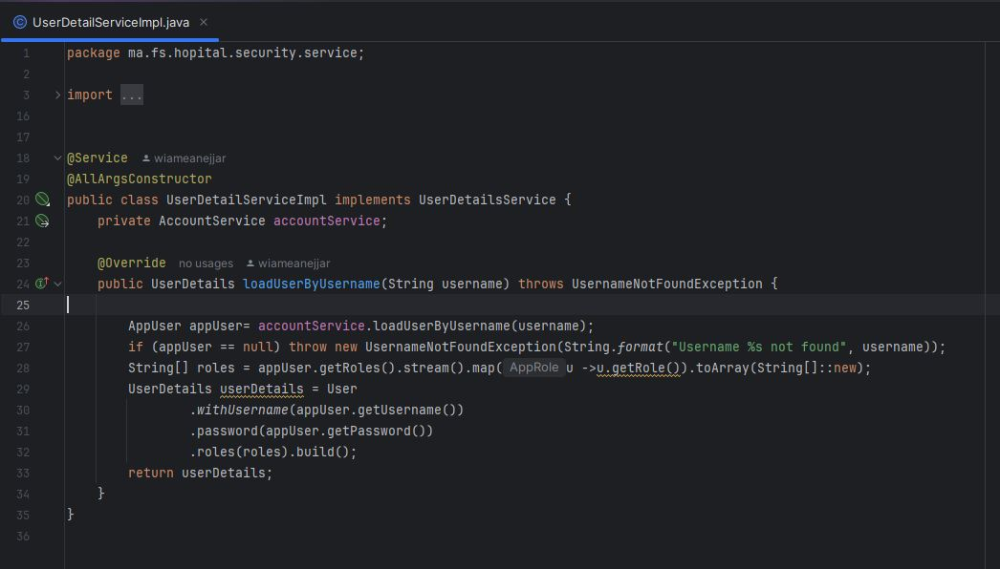
 
 #### - Classe `SecurityConfig`:
La classe SecurityConfig c'est la classe essentiel pour la configuration Spring Security, elle est marquée par @EnableWebSecurity et @EnableMethodSecurity pour activer la sécurité web et les annotations de contrôle d'accès. Elle propose trois approches d'authentification :
   - InMemory: Crée des utilisateurs en mémoire avec InMemoryUserDetailsManager,il est utile pour les tests.
   - JDBC: Permet une authentification via base de données avec JdbcUserDetailsManager.
   - Personnalisée: Dans cette approche on utilise UserDetailServiceImpl pour charger les utilisateurs depuis notre modèle personnalisé (AppUser).
La configuration active (securityFilterChain) définit :
    - Un formulaire de login personnalisé (/login) avec redirection vers /user/index après succès.
    - Un système "remember-me" avec clé unique et durée de validité (14 jours).
    - Des règles d'accès : qui permet l'accès aux ressources statiques (/webjars/**). Il exige une authentification pour toutes les autres requêtes (anyRequest().authenticated()).Ainsi , une page d'erreur dédiée (/notAuthorized).
Cette configuration offre une sécurité flexible, prête pour une montée en charge (en décommentant JDBC) tout en intégrant notre modèle métier via UserDetailServiceImpl.

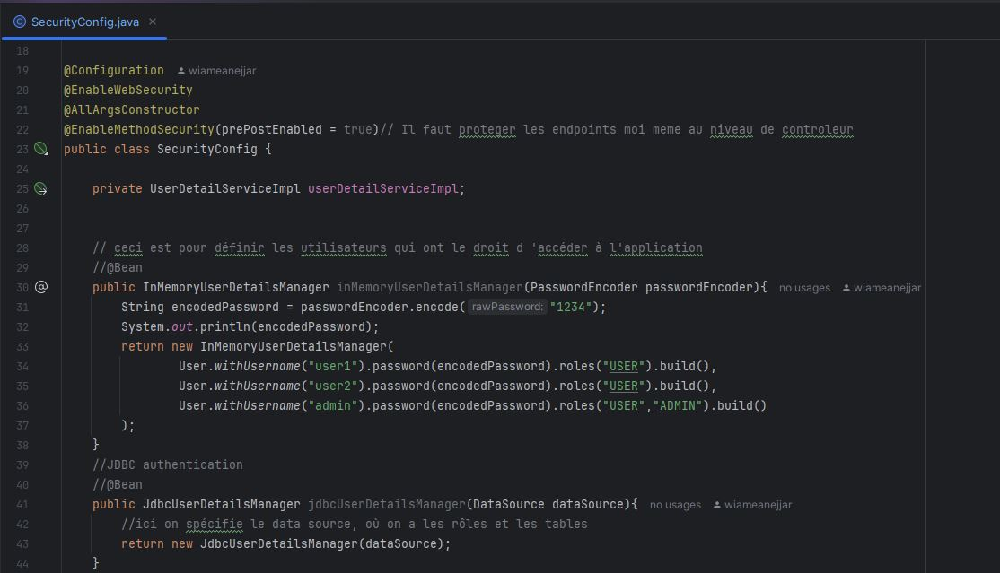
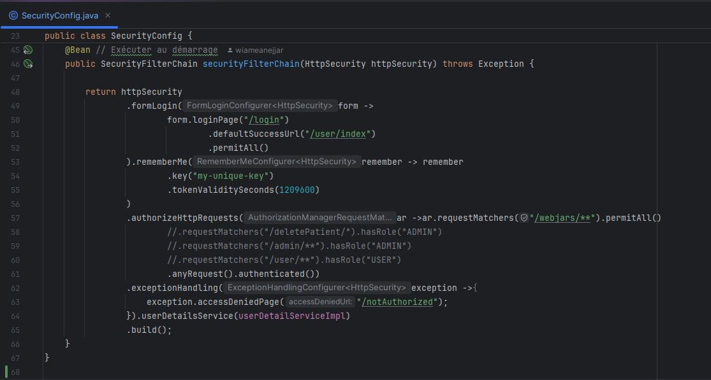

## 🌐 Web:
###  - Classe `PatientRestController`:
La classe PatientRestController est un contrôleur REST qui expose les données relatives aux patients via des endpoints HTTP. Grâce à l’annotation @RestController, Spring reconnaît automatiquement cette classe comme un composant dédié à la gestion des requêtes web.  

Elle utilise @Autowired pour injecter automatiquement une instance de PatientRepository, qui assure les opérations de persistance sur l'entité Patient.
La méthode patientList(), annotée avec @GetMapping("/patients"), est déclenchée lorsqu'une requête HTTP GET est envoyée à l'URL /patients. Cette méthode interroge la base de données via patientRepository.findAll() pour récupérer la liste complète des patients, et retourne le résultat sous forme de JSON.  

Ce contrôleur joue ainsi un rôle essentiel dans l’architecture REST de l’application, en faisant le lien entre les clients (navigateur, front-end, etc.) et la base de données via le repository.

 

## Classe Principale `HospitalApplication`:
La classe HospitalApplication constitue le point d’entrée de l’application Spring Boot de gestion hospitalière. Annotée avec @SpringBootApplication, elle active la configuration automatique de Spring ainsi que le scan des composants, ce qui permet de démarrer l'application de manière autonome.  

La méthode main() utilise SpringApplication.run() pour lancer l’application. Une méthode start() annotée avec @Bean retourne un CommandLineRunner, permettant d’exécuter automatiquement un ensemble d’instructions à l’initialisation de l’application.  
 - Voici ce que cette méthode réalise étape par étape :
    - Création de plusieurs patients à l’aide de la méthode savePatient() du service métier IHospitalService. Les données sont générées dynamiquement à partir d’une liste de prénoms.
    - Création de plusieurs médecins, chacun avec un nom, un e-mail, et une spécialité (aléatoirement "Cardio" ou "Dentiste"), via la méthode saveMedecin().
    - Récupération d’un patient et d’un médecin existants à partir de la base (par id ou nom) pour leur affecter un rendez-vous.
    - Création et enregistrement d’un rendez-vous (RendezVous) entre le patient et le médecin, avec un statut PENDING et une date courante.
    - Enfin, création d’une consultation (Consultation) liée au rendez-vous précédemment enregistré, avec un rapport médical fictif.

Ce bloc d’initialisation est très utile pour simuler un scénario clinique complet dès le lancement, ce qui facilite le test, la démonstration, et la validation fonctionnelle de l'application.
   
   

## ⚙️ Configuration (`application.properties`):
Ce fichier contient les paramètres essentiels de configuration de l’application Spring Boot, en particulier pour la gestion du port d'accès, la base de données et la console H2. Voici une explication détaillée des principales propriétés utilisées :
  - spring.application.name=Hospital : définit le nom de l’application Spring Boot comme “Hospital”.
  - spring.datasource.url=jdbc:h2:mem:hospital : configure la connexion à une base de données H2 en mémoire, nommée ici "hospital".
  - spring.h2.console.enabled=true : active la console web H2, accessible dans le navigateur à l’adresse http://localhost:8086/h2-console. Cette interface permet de visualiser et d’interroger la base de données H2 pendant l'exécution.
  - server.port=8086 : spécifie que l'application sera accessible sur le port 8086 (au lieu de la valeur par défaut 8080). Cela peut être utile pour éviter les conflits de port avec d'autres services.
    
- Résultat Attendu
Au lancement de l’application :
     - Plusieurs patients (Mohamed, Hassan, Wiame) et médecins (aymane, Hanane, yasmine) sont créés automatiquement avec des données simulées.
     - Des rendez-vous sont générés entre certains patients et médecins avec un statut initial PENDING.
     - Une consultation est enregistrée pour le premier rendez-vous, avec un rapport médical.
     - Toutes les entités (Patient, Medecin, RendezVous, Consultation) sont persistées automatiquement en base H2.

Il est possible de visualiser les tables et le contenu des enregistrements via la console H2, accessible à l’adresse :
 -  http://localhost:8086/h2-console  
en utilisant le JDBC URL suivant :
  - jdbc:h2:mem:hospital
    
## Problème rencontré: 
je voulais également vous informer que j’ai rencontré un problème sur mon PC concernant l’utilisation de XAMPP/WampServer. J’ai essayé à plusieurs reprises de le résoudre, mais je n’ai pas encore trouvé de solution définitive. Toutefois, je continue à chercher activement une solution afin de pouvoir avancer sur les prochains projets.

 ## - Conclusion
Ce TP m’a permis de mettre en œuvre une application Spring Boot complète de gestion hospitalière, avec intégration de plusieurs entités métier liées entre elles (Patient, Medecin, RendezVous, Consultation).
Grâce à Spring Data JPA, l’initialisation des données, et la console H2, j’ai pu tester le cycle complet de création, persistance et consultation des enregistrements.
Il renforce aussi la compréhension des relations entre entités, de l’utilisation des repositories JPA, et de la configuration d’une base de données embarquée pour un développement efficace.

Auteur :  
Anejjar Wiame

 
  
